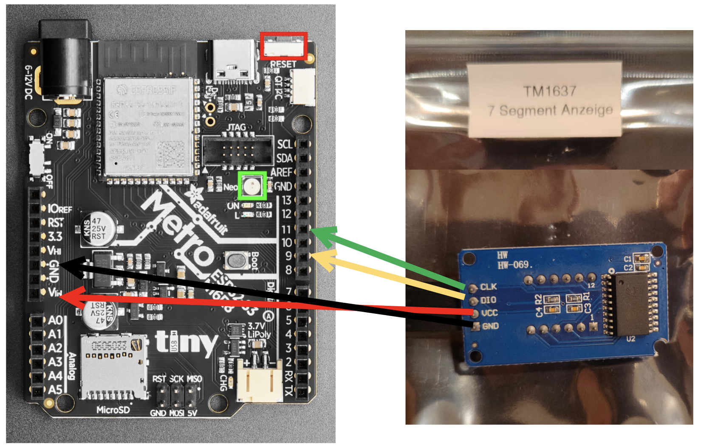

# TM1637 7-Segemnt Anzeige

Die 7-Segment Anzeige und den Adafruit Metro ESP32-S3 folgendermaßen verbinden.

- GND auf GND (0V)
- VCC auf Vin (USB 5V)
- CLK auf 11 (Digital Pin D11)
- DIO auf 9 (Digital Pin D9)



## Anzeigen einer Zahl

````python
import time
import board
from tm1637_display import TM1637Display

# -------------------------------
# KONFIGURATION
# -------------------------------

display = TM1637Display(
    clock=board.D11,            # CLK pin auf D11
    data=board.D9,              # DIO pin auf D9
    length=4,                   # Anzahl der Zahlen am Modul
    digit_order=(1, 0, 2, 3)    # Anordung der Zahken am Modul
    )
    
# -------------------------------
# Zahl setzen
# -------------------------------

display.print("9012")           # Anzeigen der Zahlen 9012
````