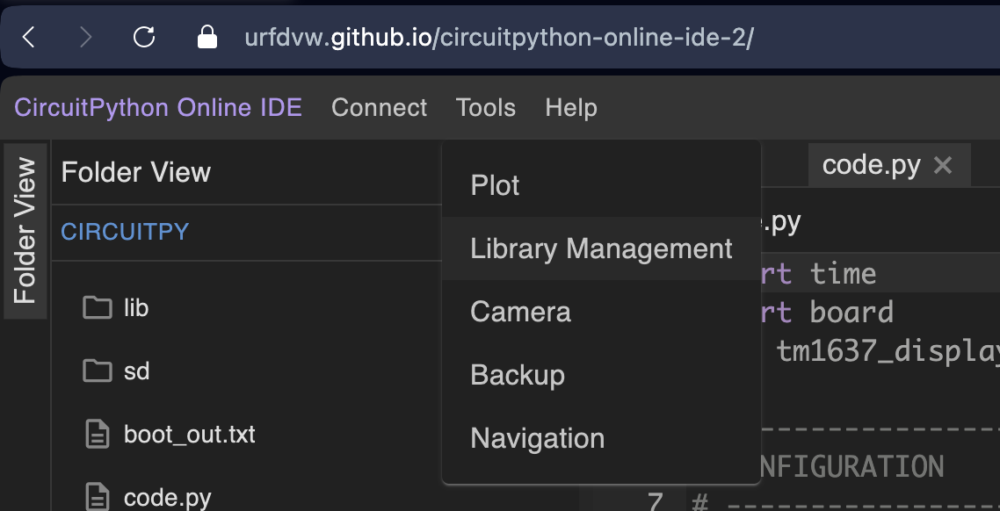
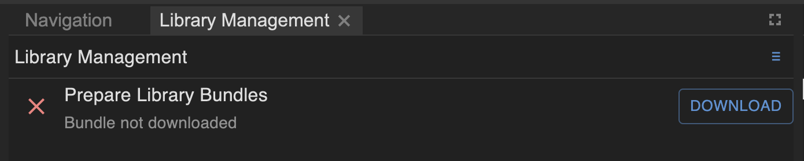
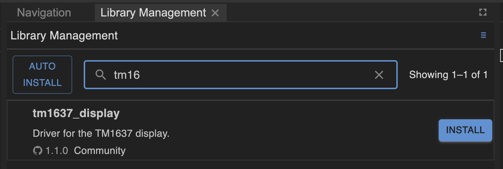

# TM1637 7-Segemnt Anzeige

Die 7-Segment Anzeige und den Adafruit Metro ESP32-S3 folgendermaßen verbinden.

- GND auf GND (0V)
- VCC auf Vin (USB 5V)
- CLK auf 11 (Digital Pin D11)
- DIO auf 9 (Digital Pin D9)


## Bibliothek hinzufügen

Um mit der 7-Segment Anzeige zu kommunizieren (reden) brauchen wir eine Bibliothek oder auch Library genannt. 
Diese kann gnaz einfach automatisch hinzugefügt werden.
Im Browser unter `Tools` und `Library Management` anklicken wie im Bild unten.



Dann sollte ein Tab im Fenster in der Mitte aufgehene mit `Library Management`.
In diesem muss beim ersten mal das `Download` bei `Prepare Library Bundles` angeklickt werden. 



Kurz warten bis alles fertig heruntergeladen ist. 
Danach auf `Auto Install` oder nach der Biblithek `tm1637_display` suchen.



Jetzt kann die 7 Segment anzeige verwendet werden. 

## Anzeigen einer Zahl

````python
import time
import board
from tm1637_display import TM1637Display

# -------------------------------
# KONFIGURATION
# -------------------------------

display = TM1637Display(
    clock=board.D11,            # CLK pin auf D11
    data=board.D9,              # DIO pin auf D9
    length=4,                   # Anzahl der Zahlen am Modul
    digit_order=(1, 0, 2, 3)    # Anordung der Zahken am Modul
    )
    
# -------------------------------
# Zahl setzen
# -------------------------------

display.print("9012")           # Anzeigen der Zahlen 9012
````

Wenn die 7-Segment anzeige nicht geht kann es an den folgende Probleme haben:

- Bibliothek nicht installiert. Serielle Konsole (Fenster rechts) zeigt: `ImportError: no module named 'tm1637_display'`
- CLK oder DIO Pin verkehrt eingesteckt. 
- VCC oder GND angeschlossen? 

## Helligkeit einstellen

In diesem beispiel wird die Helligkeit der Anzeige geändert. 

````python
import time
import board
from tm1637_display import TM1637Display

# -------------------------------
# KONFIGURATION
# -------------------------------

display = TM1637Display(
    clock=board.D11,            # CLK pin auf D11
    data=board.D9,              # DIO pin auf D9
    length=4,                   # Anzahl der Zahlen am Modul
    digit_order=(0, 1, 2, 3),   # Anordung der Zahken am Modul
    brightness = 1              # Helligekeit am Anfang 1
    )
    
# -------------------------------
# Helligkeit erhöhen
# -------------------------------

while True:                     # für immer wiederholen
    for i in range(1, 8):
        display.print("9012")   # Anzeigen der Zahlen 9012
        display.brightness = i  # Helligkeit setzen. i ist 0-7
        time.sleep(0.5)         # 1/2 sekunde schlafen
````

## Text scrollen

In diesem Beispiel wird ein text der zu lange für die Anzeige ist durchgescrollt. 

````python
import time
import board
from tm1637_display import TM1637Display

# -------------------------------
# KONFIGURATION
# -------------------------------

display = TM1637Display(
    clock=board.D11,            # CLK pin auf D11
    data=board.D9,              # DIO pin auf D9
    length=4,                   # Anzahl der Zahlen am Modul
    digit_order=(0, 1, 2, 3),   # Anordung der Zahken am Modul
    brightness = 1              # Helligekeit am Anfang 1
    )
    
# -------------------------------
# Text laufen lassen
# -------------------------------

message = "    HALLO HELLO HEJ    " # Text der laufen soll

while True:

    for pos in range(len(message) - 4):         # Text Schleife Position weiter schalten
        display.print(message[pos : pos + 4])   # Text zeigen an Position plus 3 weitere Zeichen
        time.sleep(0.4)                         # Schalfen 
````

## Zählen

````python
import time
import board
from tm1637_display import TM1637Display
import digitalio

# -------------------------------
# KONFIGURATION
# -------------------------------

display = TM1637Display(
    clock=board.D11,            # CLK pin auf D11
    data=board.D9,              # DIO pin auf D9
    length=4,                   # Anzahl der Zahlen am Modul
    digit_order=(0, 1, 2, 3),   # Anordung der Zahken am Modul
    brightness = 1              # Helligekeit am Anfang 1
    )
    
# -------------------------------
# Text laufen lassen
# -------------------------------

i=0
display.print(i)
pin = digitalio.DigitalInOut(board.D5)

# How long we want the LED to stay off
BLINK_OFF_DURATION = 1

# When we last changed the LED state
LAST_BLINK_TIME = -1

reset=True

while True:
    now = time.monotonic()
    if pin.value==False:
        if now >= LAST_BLINK_TIME + BLINK_OFF_DURATION or reset==True:
            i=i+1
            display.print(i)
            LAST_BLINK_TIME = now
            reset=False
    if pin.value==True:
        reset=True
````