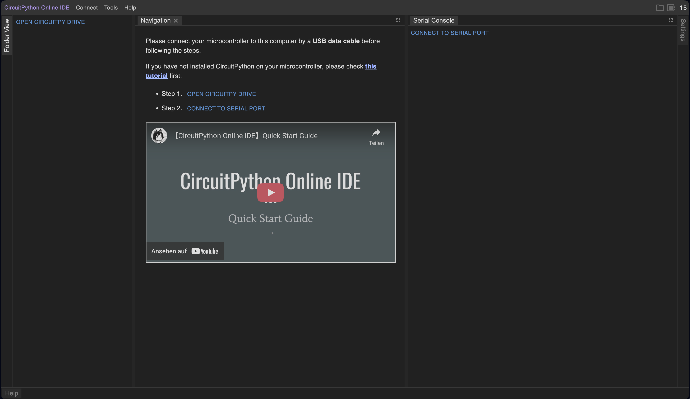
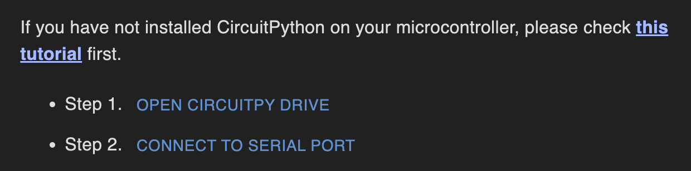
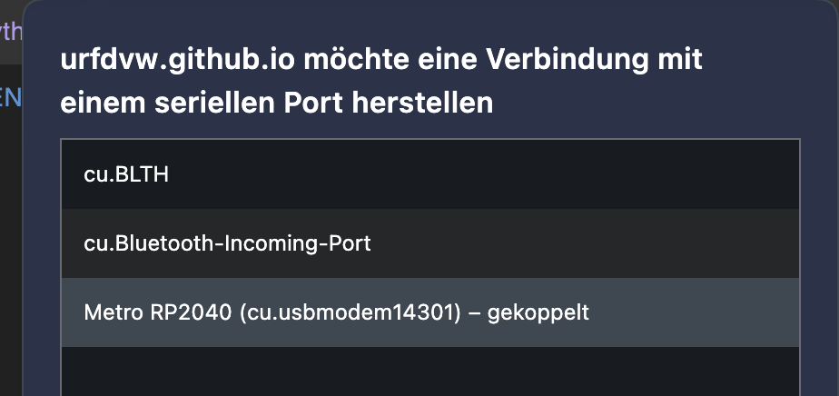
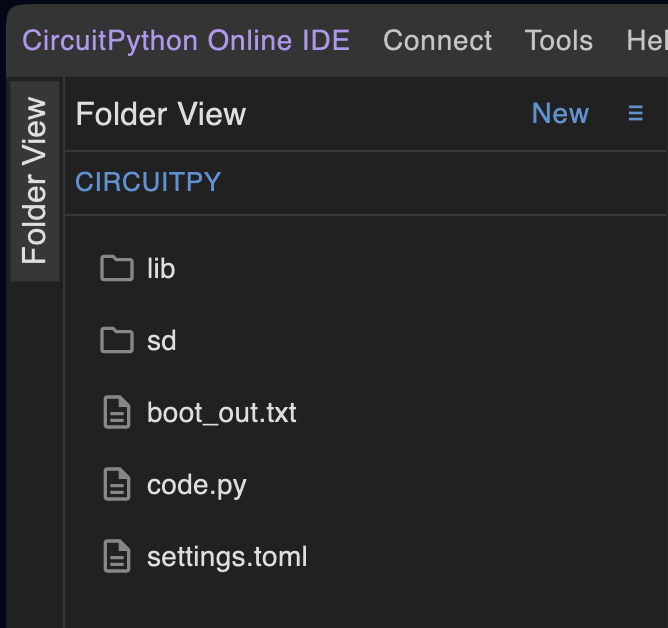

# CircuitPython mit Adafruit Metro ESP32-S3

Anleitung für einfache Experimente. 


## Einrichten

Es ist kein Programm notwendig zu installieren. 
Mit einem Brwoser wie Chrome, Edge oder Opera (Firefox, Safari oder Brave funktionieren nicht) auf folgende Seite gehen. 
[https://urfdvw.github.io/circuitpython-online-ide-2/](https://urfdvw.github.io/circuitpython-online-ide-2/). 

Dann sollte folgende Seite kommen. 



- Adafruit Metro ESP32-S3 mit einem USB-C Kabel an den Computer verbinden
- 
  - auf `Step 1. OPEN CIRCUITPY DRIVE` klicken und im Finder/Explorer die externe "Festplatte/USB-Stick" CIRCUITPY auswählen (Bestätigungen vom Browser akzeptieren)
  - auf `Step 2. CONNECT TO SERIAL PORT` klicken und im Fenster auf Metro ESP32-s3 auswählen (Bestätigungen vom Browser akzeptieren)
    - 

Dann sollten im folder view links einige Datein auftauchen und ca so ausschauen:


Jetzt auf `code.py`clicken, dass ist der code den wir bearbeiten wollen.
Dieser sollte jetzt im mittleren Fenster erscheinen. 

## LEDs 

Die LEDs und den Adafruit Metro ESP32-S3 folgendermaßen verbinden.

- Grau auf GND (0V)
- Lila auf Vin (USB 5V)
- Blau auf 5 (Digital Pin D5)


Die LEDs können vom Adafruit Metro ESP32-S3 programmiert und daher verändert werden.
Sie werden auch NeoPixel genannt oder mit der bezeichnung WS2812b. 

### LED - simple

Den Code im Browser Fenster löschen und folgenden code einfügen.
Jetzt sollten alle LEDs in Rot leuchten. 
Wir können in der letzten Zeile alle Farben ausprobieren (255,0,0) mit (0,255,0) oder (0,0,255) ersetzen. 

````python
# ===============================
# NeoPixel Grundbeispiel
# Ein Strip – eine Farbe
# ===============================

import board          # Zugriff auf die Pins des Boards
import neopixel       # NeoPixel Bibliothek
import time           

# -------------------------------
# KONFIGURATION
# -------------------------------

PIXEL_PIN = board.D5      # Pin, an dem der Strip angeschlossen ist
NUM_PIXELS = 4            # Anzahl der LEDs im Strip
BRIGHTNESS = 0.3          # Helligkeit (0.0 – 1.0)

# -------------------------------
# NEOPIXEL OBJEKT ERSTELLEN
# -------------------------------

pixels = neopixel.NeoPixel(
    PIXEL_PIN,
    NUM_PIXELS,
    brightness=BRIGHTNESS,
    auto_write=True       # LEDs aktualisieren sich sofort
)

# -------------------------------
# FARBE SETZEN
# -------------------------------

pixels.fill((255, 0, 0))  # Alle LEDs Rot (Rot, Grün, Blau), die Zahlen 0-255. 
````

### LED - Dimmen / Atmen

Mit diesem Code sollen alle LEDs langsam heller werden bis zur maximalen stärke und dann wieder dimmen bis sie ausgehen. 

Den Code im Browser Fenster löschen und folgenden code einfügen.

````python
import board
import neopixel
import time

pixels = neopixel.NeoPixel(
    board.D5,
    NUM_PIXELS = 4
    brightness=0.0,   # Start mit 0 Helligkeit
    auto_write=True
)

while True:
    # Helligkeit hochfahren
    for b in range(0, 100):
        pixels.brightness = b / 100
        pixels.fill((0, 0, 255))  # Blau
        time.sleep(0.02)

    # Helligkeit runterfahren
    for b in range(100, 0, -1):
        pixels.brightness = b / 100
        pixels.fill((0, 0, 255))
        time.sleep(0.02)
````
